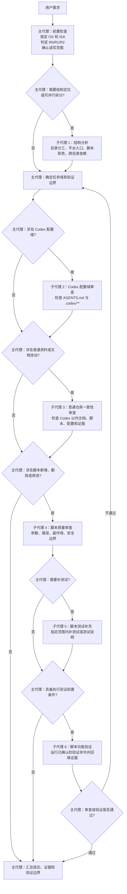

## 1. 基础约束

### 1.1 最高优先级

- 以当前仓库根目录中的 AGENTS.md 文件作为本仓库最高优先级项目指令。
- 当前仓库是 Python MCP Server、Agent Skills 运行、示例技能、启动脚本、测试、打包和发布资料库，不是 Agent Skills 官方规范仓库，也不是参考仓库的业务资料仓库。不得把参考仓库的构建、打包、运行规则、子代理角色或机器路径直接写成本仓库通用规则。
- 本仓库包含 Windows/Linux/macOS + AMD64/ARM64 组合。回答、分析、修改、执行脚本或验证前，必须先锁定目标操作系统信息和指令集架构。涉及运行、打包、发布、MCP 服务、脚本或技能发现时，还必须继续锁定 Python 版本、uv/uvx、FastMCP、skills root、transport、host、port、path、CORS、Docker、浏览器或客户端环境等当前任务依赖的版本和配置。
- 修改、完善、修复或补充内容时，若用户未明确要求大范围改写或重构，应优先做满足目标的最小充分改动，并保留既有结构和表达风格，反之则可以大范围地改写或者重构。
- 编写或修改说明文档时，应让内容自然、具体，像写给协作者看的说明，避免模板化套话、堆砌式表达和自我标榜式总结。
- 对于执行测试用例脚本命令时，外层等待工具的超时时间必须设置为至少 30 分钟，即 `1800000` 毫秒或更长，曾触发 120 秒外层等待超时，因此不能使用默认等待时间或 120 秒超时作为最终构建状态依据。
- 对于执行非测试用例脚本命令时，外层等待工具的超时时间必须设置为至少 6 小时，即 `21600000` 毫秒或更长，曾触发 4 小时外层等待超时，因此不能使用默认等待时间或 4 小时超时作为最终构建状态依据。

### 1.2 平台信息发现

若本轮尚未锁定基础平台信息，必须先读取 .codex\HelperScripts\README.md 文件，并按该 README 中当前平台、使用场景、执行时间注意事项和完整命令运行对应入口脚本。

### 1.3 文件和敏感信息

- 当前仓库目录中的文档与脚本默认按 UTF-8 读取。使用 PowerShell 读取文本时优先使用 `Get-Content -Raw -Encoding UTF8 <path>` 命令。
- 新建或修改文本文件前必须查看仓库中的 .editorconfig 文件，并按目标路径实际匹配规则处理编码、换行、缩进、尾随空白和文件末尾换行，使得新建或修改文本文件符合仓库中 .editorconfig 文件的规则。
- 文档中的账号、密码、提取码、私有镜像地址和机器私有路径默认视为敏感或过期信息，只能用于理解背景，不得复用，不得在回答中扩散具体值。
- 允许创建临时文件或目录用于复现、排障、测试和验证。验证完成后必须清理，不得把临时产物留在仓库中。

### 1.4 资料入口

- 根目录 `README.md` 是仓库总览、CLI/MCP Server 使用方式、skills 目录结构和典型工作流入口。
- `src/skillz/` 保存 Skillz Python 包、CLI 入口、MCP Server、技能发现、资源注册、CORS、日志和热重载实现。
- `tests/` 保存 pytest 测试，覆盖 CLI、registry、resources、tools、zip/.skill 包和 hot reload。
- `SetupAndRun/` 保存 Windows 本地配置、启动 Skillz MCP Server 的 PowerShell 流程、schema、示例配置和脚本测试。
- `Skills/` 保存随仓示例 Agent Skills，每个 skill 的 `SKILL.md`、`references/` 和 `assets/` 都可能被 Skillz 发现并暴露为 MCP 资源。
- `pyproject.toml`、`uv.lock` 和 `Dockerfile` 是 Python 依赖、构建、容器运行和发布相关入口。
- `.github/workflows/` 保存 CI、PyPI 发布和 Docker 镜像发布流程。
- `.codex/` 保存本仓库项目级 Codex 配置、子代理定义、规则文件和平台信息发现脚本，不是 Skillz 运行时配置。

## 2. 任务判级

### 2.1 判级总则

- 按当前任务的真实操作对象、文件影响面和验证目标判定等级。若同一任务包含多个等级，按最高等级执行。
- 任务执行中发现需要扩大范围时，必须先重新判级，再补齐对应验证。
- 为复现或验证临时创建且已清理的临时文件，不单独提升等级。若临时产物被保留为仓库内容、测试数据、脚本输入或交付物，必须按其用途重新判级。
- 无法判断某个文件是否被脚本、测试、构建、发布或运行流程直接读取时，先用源码、脚本、配置、文档或官方资料核验。无法排除直接消费关系时，按更高等级处理。
- 任务分级
  - R0：只读分析
  - R1：文档和 Codex 配置说明
  - R2：脚本和可执行流程

### 2.2 R0

- 只读取、搜索、分析、解释、排查，不新增、不删除、不修改仓库文件。
- 典型场景包括理解目录结构、定位平台入口、静态检查脚本参数、阅读日志、查看 diff、核验路径是否存在。
- 可执行命令应限于只读或无持久副作用命令，例如 `rg`、`Get-Content`、`Test-Path`、`git status`、`git diff`、脚本帮助输出和参数分支静态检查。
- 结论必须明确说明本次只做静态核验，未执行完整构建、打包、安装或运行验证。

### 2.3 R1

- 只修改说明文档、Codex 指令、Codex 说明、子代理说明或上下文发现说明，且这些文件不被 skillz 源码、测试断言、安装、打包、发布或运行流程直接消费。
- 典型文件包括 `*.md`、`.codex/agents/*.toml`、`.codex/agents/README.md`、`.codex/rules/**`、`.codex/config.toml` 和 `AGENTS.md`。
- 若新增或修改 `.codex/HelperScripts/**` 中的脚本，不能仅按 R1 处理。脚本文件必须按 R2 的脚本验证要求补齐测试证据。
- R1 验证以静态核验为主，重点检查章节结构、路径、链接、平台范围、术语、证据来源和 Codex 配置域一致性。

### 2.4 R2

- 修改或新增任何 `*.sh`、`*.bash`、`*.bat`、`*.ps1`、`*.pl`，或修改脚本参数解析、默认值、路径处理、核心流程、输出格式、错误处理、清理逻辑，均为 R2。
- 修改测试、测试数据、schema、Python 源码、CLI/MCP Server 行为、`SetupAndRun` 启动流程、`Skills/**/SKILL.md`、`Skills/**/assets/tool-contract.json`、构建、发布、安装、打包、运行入口，或用户要求给出构建、打包、运行、技能发现、依赖同步、容器或发布结论，也按 R2 处理。
- R2 必须记录自动创建的验收标准，至少覆盖功能正确性、参数契约、失败路径、副作用边界、日志或输出健康度、临时产物清理。
- 若无法在目标平台执行完整验证，必须写明未执行原因、当前验证边界、替代验证方式、剩余风险和需要开发者补跑的命令。

## 3. 执行规范

### 3.1 执行前检查

- 先确认目标系统和指令集架构和任务等级。必要时运行 `.codex/HelperScripts` 中的当前平台入口生成 JSON 证据。
- 再确认本轮允许读写范围。不得恢复、覆盖、格式化或清理与本任务无关的用户改动。
- 涉及 Python/uv/FastMCP 版本、工具链、构建方案、依赖根、构建目录、发布目录、发行版等时，只能使用用户提供、脚本文档声明或本轮核验得到的真实值。不得用历史示例、默认路径或猜测值补齐。
- 涉及删除、覆盖目录、安装、发布、打包、下载依赖、写注册表、修改持久环境变量或清理缓存时，必须先说明影响范围、目标路径、可回滚性和清理方案。

### 3.2 命令和脚本

- 优先用静态方式确认脚本支持的参数、固定输入、默认输出和写入位置。推荐先用 `rg -n` 搜索 `--help`、`--check-only`、`--dry-run`、`--diag`、`-WhatIf`、`-Confirm`、参数解析分支和删除覆盖逻辑。
- 只执行已确认存在且适用于当前平台的参数。不得用不存在的参数试探脚本行为。
- 对会写入仓库或外部目录的脚本，执行前必须声明预计写入位置。执行后必须列出新增、修改、保留或清理的产物。
- 对 Windows 批处理和 PowerShell 脚本，优先在 Windows、cmd 或 PowerShell、必要时结合 uv/uvx 或 Python 环境中执行。
- 对 Linux 脚本，优先在对应 Linux 目标环境中执行。
- 对 macOS 脚本，优先在 macOS ARM64 目标环境中执行。
- 当前环境无法执行目标平台脚本时，可做语法检查、参数静态核验、配置 JSON 校验和只读审查，但不得写成完整验证通过。

### 3.3 文件操作

- 修改文件必须限制在用户需求和本轮判级允许范围内。若必须扩大修改范围，先说明原因并重新判级。
- 文档修改应顺着原文结构补充或重排，保持术语、编号、语气和粒度一致。
- 新增脚本必须同时补充用途、参数、默认副作用、输出字段、失败行为和验证方式。
- 仓库外路径默认只读、只执行。除用户明确授权或脚本验证临时产物外，不得写入仓库外路径。

### 3.4 证据记录

- 对关键读取、静态核验、脚本执行、测试和构建命令，记录命令意图、工作目录、关键实参、退出码、关键输出和日志位置。
- 命令失败、超时、路径缺失、参数不匹配或平台入口缺失时，不得继续假设成功。必须说明失败阶段、首个有效错误、阻塞项和下一步处理办法。
- 资料冲突时，说明冲突来源、取舍依据和当前采用结论。

## 4. 回归与验证

### 4.1 通用要求

- R0 做静态核验，输出静态证据和验证边界。
- R1 做文档和配置一致性核验，必要时委派 Codex 配置域审查。
- R2 必须给出脚本或可执行流程的测试证据。不能把帮助输出、语法检查或 dry run 写成完整主流程验证。

### 4.2 脚本变更最低验证

- 参数契约测试覆盖 `--help`、未知参数、缺失参数、退出码和错误信息。
- 默认行为测试确认脚本默认不发生非预期写入、删除、安装、下载或外部状态变更。
- 安全模式测试覆盖脚本明确支持的 `--check-only`、`--dry-run`、`--diag`、`-WhatIf` 或同等参数。
- 主流程冒烟测试在隔离目录或目标平台允许范围内执行最小成功路径。
- 失败路径测试覆盖依赖缺失、路径非法、权限不足、配置错误、输入缺失等场景。
- 副作用与清理测试检查脚本创建的目录、文件、日志和缓存是否符合预期，并确认测试结束后清理临时产物。
- 脚本包含删除、覆盖、批量写入或清空目录行为时，必须增加防误删和防越界测试。

### 4.3 结论格式

- 涉及脚本变更时，回答必须给出测试环境、测试命令、预期结果、实际结果、清理情况和结论状态。
- 结论状态只能写通过、失败或部分通过。
- 未执行的测试必须明确列出原因、验证边界、替代核验和需要补跑的命令。

## 5. 子代理使用规范

### 5.1 总则

- 当前仓库的项目级子代理定义在 `.codex/agents/`。子代理只辅助主代理分析、审查、补测试或验证，不能替代本文件的最高优先级规则。
- `session_state_maintainer` 是会话级状态维护子代理。当前会话开始后，主代理必须优先尝试启动该子代理，使用 `fork_context=false` 的自包含任务包，并在会话生命周期内持续复用它维护 Codex Home 下的仓库外状态文件。
- `session_state_maintainer` 的“常驻”和“轮询”含义是：主代理在会话开始、关键节点、压缩前和恢复后主动向该子代理发送自包含状态包。该子代理基于状态包更新状态文件。不得假设子代理能自动读取主代理未提供的隐含上下文，也不得让它启动后台无限循环或常驻进程。
- 主代理每次向 `session_state_maintainer` 发送 `session_start`、`progress_checkpoint`、`pre_compaction`、`post_compaction_resume` 或 `final_summary` 状态包后，必须等待子代理返回成功写入结果。仅已发送请求、收到非成功结果、超时、字段缺失、路径未核验或只记录阻塞，都不算状态维护完成。可修正的问题必须修正任务包后重试，无法成功写入时必须停止主线并记录阻塞。
- 主代理在主动压缩、准备请求压缩、长任务续跑前、多子代理等待前、上下文压力明显升高或预期可能自动压缩时，必须向 `session_state_maintainer` 发送 `pre_compaction` 自包含状态包，并等待成功写入。自动压缩不保证存在可执行的运行时前置 hook，因此主代理必须通过关键节点和压缩风险前检查点尽力降低状态丢失风险，不得声称状态代理能自行感知压缩或自动轮询。
- 发生主动压缩、自动压缩、上下文恢复或长任务续跑后，主代理恢复执行的第一项主线前置动作必须是状态维护握手：解析并核验 `CODEX_HOME` 和会话 ID，启动或复用 `session_state_maintainer`，发送 `post_compaction_resume` 自包含状态包，并等待成功写入。若失败、超时、状态包字段缺失、路径不可写、路径未核验或返回非成功，主代理必须修正任务包并重试。无法成功时必须停止主线并记录阻塞。成功写入前，不得继续执行主线编辑、测试、验证、最终答复或派发其它非恢复用途子代理。
- `post_compaction_resume` 成功写入后，主代理恢复执行的第二项主线前置动作必须读取并详细分析刚更新成功的 Codex Home `SessionState.md`，再结合压缩摘要、`AGENTS.md`、`.codex/agents/README.md`、相关 `.codex/agents/*.toml` 和当前差别重建本轮状态。读取失败、路径不一致或内容不是最新状态时，必须重试读取或重新触发状态维护，不能凭压缩摘要继续。第二动作完成前，不得继续主线编辑、测试、验证、最终答复或派发非恢复用途子代理。
- 主代理必须在派发 `session_state_maintainer` 前解析出主会话状态文件绝对路径，并把该路径写入任务包。默认状态文件位置是 Codex Home 下的主会话目录：Windows 使用 `%CODEX_HOME%\session-state\skillz\<MAIN_CODEX_THREAD_ID>\SessionState.md`，Linux/macOS 使用 `${CODEX_HOME}/session-state/skillz/<MAIN_CODEX_THREAD_ID>/SessionState.md` 文件。环境变量 `CODEX_HOME` 不可用时必须记录阻塞，不得回退写入当前仓库。主会话 `CODEX_THREAD_ID` 不可用时，主代理必须在任务包中提供替代主会话 ID、来源、保留策略和清理策略。
- 不得要求 `session_state_maintainer` 根据它自己运行环境中的 `CODEX_THREAD_ID` 推导状态文件路径。子代理环境中的 `CODEX_THREAD_ID` 可能是子代理线程 ID，不等于主会话 ID。状态文件路径、主会话 ID 和路径来源必须由主代理显式提供。
- 当前会话无法按名称热加载或调用 `session_state_maintainer` 时，主代理必须读取 `.codex/agents/SessionStateMaintainer.toml` 的 `developer_instructions` 内容，按同样口径等效维护状态文件或记录无法维护的阻塞原因和验证边界。
- 用户明确要求使用子代理或并行子代理时，主代理应先判断任务能否按 Codex 配置域、普通资料域、平台目录、脚本职责或审查角色拆分。可并行拆分时，自动并行派发必要子代理集合，等待全部结果后再汇总。
- 用户明确要求使用子代理或并行子代理、任务进入多子代理协作、脚本变更、Codex 配置域同步或普通资料一致性审查等任务，主代理必须把 5.3 代理编排流程图作为编排审计清单。严格按照流程图执行的含义是逐项判断适用节点、派发必要子代理、等待适用结果并记录裁剪理由，而不是机械派发所有子代理。
- 主代理使用项目级子代理时，不得使用完整历史 fork 作为子代理上下文，也不得让子代理依赖未写入任务包的历史对话。每次派发都必须把任务目标、背景、证据、边界和期望输出显式写入子代理输入。
- 若当前工具同时支持 `agent_type` 和上下文 fork 选项，项目级 `agent_type` 子代理必须使用不 fork 完整历史的调用方式。只有非项目级、非 `agent_type` 的普通延续任务才可在工具允许时使用完整历史 fork。
- 子代理输出只能作为证据来源和建议。最终任务等级、修改取舍、验证结论和面向用户的答复由主代理负责。
- 当前环境无法按名称调用项目级子代理时，主代理应读取对应 `.codex/agents/*.toml` 的 `developer_instructions` 内容，按同样口径完成等效审查，并说明验证边界。

### 5.2 子代理清单

| 子代理 | 主要职责 | 权限边界 |
| --- | --- | --- |
| `codex_conformity_reviewer` | 审查 `AGENTS.md`、`.codex/**` 以及其它 Codex 相关说明是否同步。 | 只读。 |
| `repo_conformity_reviewer` | 审查普通仓库文件改动后，文档、脚本、配置、schema、测试证据和资料入口是否对齐。 | 只读。 |
| `RepoStructureAnalysis` | 分析仓库结构、平台入口、脚本职责和跨目录依赖。 | 只读。 |
| `repo_script_code_quality_reviewer` | 审查仓库脚本新增、删除或修改后的参数、路径、副作用、安全边界和平台差异。 | 只读。 |
| `repo_script_test_case_engineer` | 在主代理指定范围内为脚本变更补充测试、测试数据或测试说明。 | 可写指定测试范围。 |
| `repo_script_functional_verifier` | 在主代理指定范围内运行已静态确认的脚本验证命令并回填证据。 | 可写日志、缓存和临时验证产物。 |
| `session_state_maintainer` | 在会话生命周期内按主代理状态包维护 Codex Home 下的仓库外状态文件，辅助压缩恢复和防止失焦。 | 可写指定状态文件。 |

### 5.3 代理编排流程图

下面流程图是本仓库多子代理协作的默认基线。简单 R0 只读问答、单点 R1 文档调整或风险很低的静态核验，可由主代理按实际范围裁剪，但不得静默跳过适用节点。只要任务进入多子代理协作、脚本变更、Codex 配置域同步或普通资料一致性审查，就应保留图中适用的前置检查、审查节点、验证节点和失败回退关系，并记录不适用或跳过的理由。流程图只描述主代理和子代理编号之间的协作关系，不在图中固定具体子代理名称。正式子代理名称以图后的对应表和 `.codex/agents/*.toml` 为准。

`session_state_maintainer` 是会话级常驻状态代理，不替代下图中的审查、测试或验证节点，也不改变主代理对最终结论的责任。主代理应在进入下图前或前置检查完成后启动它，并在每个适用节点完成、失败、裁剪、阻塞、压缩前或恢复后发送状态包，使其持续更新 Codex Home 状态文件。

| 流程编号 | 正式子代理名称 | 主要职责 |
| --- | --- | --- |
| 子代理 1 | `RepoStructureAnalysis` | 只读分析目录分工、平台入口、脚本职责和跨目录依赖。 |
| 子代理 2 | `codex_conformity_reviewer` | 审查 `AGENTS.md`、`.codex/**` 以及其它 Codex 相关说明是否同步。 |
| 子代理 3 | `repo_conformity_reviewer` | 审查普通仓库文件改动后，文档、脚本、配置、schema、测试证据和资料入口是否对齐。 |
| 子代理 4 | `repo_script_code_quality_reviewer` | 审查仓库脚本新增、删除或修改后的参数、路径、副作用、安全边界和平台差异。 |
| 子代理 5 | `repo_script_test_case_engineer` | 在主代理指定范围内为脚本变更补充测试、测试数据或测试说明。 |
| 子代理 6 | `repo_script_functional_verifier` | 在主代理指定范围内运行已静态确认的脚本验证命令并回填证据。 |
| 会话状态代理 | `session_state_maintainer` | 按主代理状态包维护 Codex Home 状态文件，辅助压缩恢复，不替代流程节点。 |

主代理在使用上图时，应维护 5.3 编排审计表。审计表至少记录：流程节点、是否触发、对应子代理名称、并行或串行关系、任务包边界、等待条件、结论状态、裁剪理由、失败回退和验证边界。若当前环境不能实际派发子代理，应在同一张审计表中写明不可用原因、等效审查方式和剩余风险。其中 5.3 编排审计表固定字段如下，主代理可按任务规模合并相邻节点，但不得删除适用字段。

| 字段 | 记录要求 |
| --- | --- |
| 流程节点 | 写明对应 5.3 节点，例如前置检查、结构分析、Codex 配置域审查、普通仓库一致性审查、脚本质量审查、补测试、功能验证或汇总。 |
| 是否触发 | 写 `触发`、`裁剪`、`不适用` 或 `阻塞`，并和任务等级、文件范围、验证目标对应。 |
| 对应子代理 | 写正式子代理名称，未派发时写 `无`，并说明由主代理等效审查或不适用。 |
| 并行或串行关系 | 写明与其它子代理并行、串行、等待前置结果或不涉及并发。 |
| 任务包边界 | 概述交给子代理的目标、读写范围、禁止事项、关键路径和停止条件。 |
| 等待条件 | 写明等待哪些子代理结果、超时或阻塞时的处理方式。 |
| 结论状态 | 写 `通过`、`失败`、`部分通过`、`未执行` 或 `阻塞`，并引用关键证据。 |
| 裁剪理由 | 对未派发或跳过节点说明原因，例如任务域不涉及、风险低、无脚本变更或当前环境不可用。 |
| 失败回退 | 写明审查或验证失败后回到哪个节点、由谁修复或需要用户补充什么信息。 |
| 验证边界 | 写明只读静态核验、R1 文档核验、R2 动态验证、未覆盖平台或剩余风险。 |

### 5.4 派发时机

- 当前会话开始后，主代理必须优先尝试启动 `session_state_maintainer` 子代理。长任务、多子代理协作、R2 脚本任务、预期发生上下文压缩、压缩前、恢复后或用户明确要求状态追踪时，必须持续向该子代理发送状态包。
- 主代理发送任何状态包后，必须等待 `session_state_maintainer` 明确返回成功写入。失败、超时、字段缺失、路径未核验或返回非成功时，必须修正可修正问题后重试。无法成功写入时必须停止主线并记录阻塞，不得把“已发送请求”或“已记录阻塞”当作状态维护完成。
- 主代理在主动压缩、准备请求压缩、长任务续跑前、多子代理等待前、上下文压力明显升高或预期可能自动压缩时，必须发送 `pre_compaction` 状态包并等待成功写入。自动压缩无法保证主代理有机会在触发瞬间执行前置 hook，因此该检查点应在可预期风险出现时提前完成。
- 状态包类型至少包括 `session_start`、`progress_checkpoint`、`pre_compaction`、`post_compaction_resume` 和 `final_summary`。其中 `pre_compaction` 是压缩前状态检查点，不能被普通进展说明替代。`post_compaction_resume` 是上下文恢复后的第一动作，不能被普通任务进展、继续编辑或最终答复替代。
- 修改 `AGENTS.md`、`.codex/config.toml`、`.codex/rules/**`、`.codex/agents/*.toml`、`.codex/agents/README.md` 或 `.codex/HelperScripts/**` 后，应委派 `codex_conformity_reviewer` 子代理做只读一致性审查。
- 修改普通仓库文档、源码说明、测试说明、SetupAndRun 说明、Skills 说明、schema、workflow 或测试证据后，应按风险委派 `repo_conformity_reviewer` 子代理。
- 每次需要理解目录分工、平台入口、脚本职责或跨目录依赖时，应先委派 `RepoStructureAnalysis`。
- 新增、删除或修改仓库脚本后，应先委派 `repo_script_code_quality_reviewer`。需要补测试时再委派 `repo_script_test_case_engineer`。具备可执行前置条件后，再委派 `repo_script_functional_verifier` 子代理。

### 5.5 任务包要求

- 子代理任务包必须是自包含输入，至少包含目标、背景摘要、范围、禁止事项、当前平台信息、指令集架构、任务等级、允许读写范围、已核验证据、关键路径、期望输出和停止条件。
- 任务包必须说明本轮是否涉及 Python/uv/FastMCP 版本、工具链、构建方案、依赖根、构建目录、发布目录、发行版、网络、凭据或外部路径。涉及时必须提供来源和核验结果；不涉及时必须明确写“不适用”；缺失且影响判断时必须标为阻塞。
- 任务包必须列出子代理需要优先读取或核验的本地文件、diff 范围、命令证据、日志证据或测试证据，并说明哪些结论已由主代理核验、哪些需要子代理独立确认。
- 任务包不得只写“按历史上下文处理”“见上文”或其它依赖完整历史的描述。必须把子代理完成任务所需的背景、用户要求、取舍结论和验证边界直接写入任务包。
- 写权限子代理只能在主代理指定范围内工作。并行写任务必须确保写入集合互不重叠，并写清允许创建的临时产物、清理要求和禁止触碰的路径。
- 派发 `session_state_maintainer` 时，任务包还必须包含由主代理解析的 Codex Home 状态文件绝对路径、路径来源、`CODEX_HOME` 核验证据、主会话 ID、主会话 ID 来源、状态文件保留和清理策略、状态包类型、当前状态包、禁止记录敏感信息要求，以及只允许写入该状态文件及其父目录的边界。不得只提供路径协议让子代理自行推导。

### 5.6 子代理自查和回补

- 子代理收到任务包后，应先独立读取 `AGENTS.md`、`.editorconfig`、任务包指定文件和最小必要关联文件，确认任务等级、平台范围、读写边界、证据来源和输出格式。
- 子代理应独立核验自己职责内的关键细节，例如文件是否存在、TOML 字段是否一致、脚本参数是否真实支持、文档声明是否有事实证据、验证命令是否在允许范围内。
- 子代理不得把未读取、未核验或任务包未提供的信息写成事实。无法独立确认但不影响继续审查的内容，应列入剩余风险；影响继续工作的内容，应停止并请求主代理补充。
- 子代理向主代理请求补充时，应明确列出缺失字段、为什么该字段影响判断、建议主代理读取或提供的证据位置，以及在补齐前能够继续完成的有限范围。

### 5.7 压缩和恢复交接规则

- 发生自动压缩、主动压缩、上下文恢复或长任务续跑后，主代理继续工作前必须重建本轮状态摘要，不能依赖压缩前的隐含记忆。
- 主代理在主动压缩、准备请求压缩、长任务续跑前、多子代理等待前、上下文压力明显升高或预期可能自动压缩时，必须先发送 `pre_compaction` 状态包并等待成功写入。该状态包应尽量覆盖 `.codex/agents/SessionStateMaintainer.toml` 中 `状态文件格式` 小节规定的章节，尤其是最新用户目标、已核验条件、编排审计表、子代理状态、文件和验证证据、任务进度、剩余风险、禁止事项和下一步停止条件。
- 自动压缩不保证存在主代理可执行的压缩前 hook，若压缩发生前未能写入 `pre_compaction`，恢复后必须在 `post_compaction_resume` 中记录缺失原因和验证边界，不得把状态代理写成能自动轮询或自行感知压缩。
- 状态摘要必须覆盖 `.codex/agents/SessionStateMaintainer.toml` 中 `状态文件格式` 小节的全部章节。旧版独立字段如“等待状态”“无关脏改动处理方式”不再作为单独必填字段；相关信息应并入“子代理状态”“文件和验证证据”“任务进度”或“剩余风险”中。
- 若恢复后的上下文缺少上述状态章节，主代理必须重新读取 `AGENTS.md`、`.codex/agents/README.md`、相关 `.codex/agents/*.toml` 和当前差别，补齐后再继续执行或汇总。
- 压缩后继续使用子代理时，新的任务包仍必须自包含，并写明压缩前已确认的证据、压缩后重新核验的证据、未恢复的信息和当前验证边界。
- 压缩恢复后的固定顺序是：第一动作发送 `post_compaction_resume` 状态包并等待状态文件成功写入，第二动作读取并详细分析刚更新成功的 Codex Home `SessionState.md`，再结合压缩摘要、`AGENTS.md`、`.codex/agents/README.md`、相关 `.codex/agents/*.toml` 和当前差别重建本轮状态。第一动作未成功、第二动作未完成前，不得继续主线编辑、测试、验证、最终答复或派发非恢复用途子代理。
- 压缩恢复后的状态维护握手必须写入 5.3 编排审计表和状态文件。若压缩摘要没有保留 `session_state_maintainer` 的 agent id、状态文件路径或最近一次写入结果，主代理必须按缺失字段处理：重新核验 `CODEX_HOME`、会话 ID 和状态文件路径，重新启动或等效维护状态文件，并在 `post_compaction_resume` 状态包中说明缺失来源。
- `post_compaction_resume` 状态包必须显式包含主会话 ID、主会话状态文件绝对路径、路径来源、压缩摘要来源、压缩后重新核验的 `AGENTS.md` / `.codex/agents/README.md` / 相关 TOML / 当前差别、已发现的缺失字段，以及恢复后第一动作的执行结果。
- 若状态文件缺失、不可读、路径未核验、读取到的不是刚更新成功的状态、`post_compaction_resume` 写入失败或返回非成功，主代理必须重试可修正步骤。无法成功时必须记录阻塞或验证边界并停止主线，不得把缺失内容凭记忆补齐，也不得把状态代理写入成功本身当作恢复完成。

具体 `Codex Session State` 模板以 `.codex/agents/SessionStateMaintainer.toml` 的 `状态文件格式` 小节为准，而 `AGENTS.md` 不重复维护完整模板，只规定主代理在压缩和恢复时必须覆盖的状态类别、成功门槛和恢复流程。当前必须覆盖的状态类别包括：元信息、资料快照、已核验条件、编排审计表、子代理状态、计划描述、任务进度、文件和验证证据、剩余风险、禁止事项、下一步停止条件。修改 `SessionStateMaintainer.toml` 的状态文件格式时，应同步核验本节的状态类别和恢复契约是否仍一致，但不得把完整模板重新复制回 `AGENTS.md` 文件中。

## 6. 输出要求

- 使用中文回答，表达通俗、直接、可执行。
- 先给结论，再给证据和操作细节。结论不确定时，明确写“不确定”“阻塞”或“需要补充”。
- 涉及平台、版本、工具链、构建方案、依赖根、构建目录、发布目录或运行环境时，必须显式标注适用范围。
- 涉及流程时，必须给出前置条件、操作步骤、检查点、常见错误和处理办法。
- 涉及命令、脚本或验证时，必须说明命令意图、关键实参、工作目录、退出码和关键输出。
- 涉及文件修改时，必须说明改动文件、改动目的、静态核验或测试结果，以及是否触碰无关工作区改动。
- 涉及 R0、R1、R2 时，必须明确任务等级和验证边界。
- 涉及脚本变更时，必须按第 4 章给出测试证据和清理情况。
- 回答本仓库问题时优先给出本地文件路径、脚本输出或官方链接作为证据。证据不足时说明缺口，不用猜测补足。

## 7. 参考链接

- [Skillz GitHub 仓库](https://github.com/intellectronica/skillz)
- [Agent Skills](https://agentskills.io/home)
- [FastMCP 文档](https://gofastmcp.com/)
- [uv 官方文档](https://docs.astral.sh/uv/)
- [Python 官方文档](https://docs.python.org/)
- [PyPI skillz 项目页](https://pypi.org/project/skillz/)
- [Docker 官方文档](https://docs.docker.com/)
